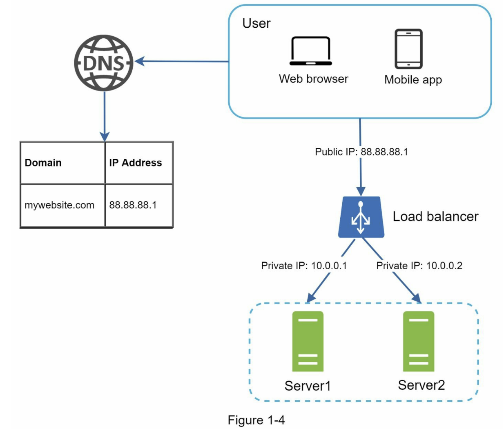

# 가상 면접 사례로 배우는 대규모 시스템 설계 기초

## 참조
* https://github.com/G33kzD3n/Catalogue/blob/master/System%20Design%20Interview%20An%20Insider%E2%80%99s%20Guide%20by%20Alex%20Xu%20(z-lib.org).pdf

## 1. 사용자 수에 따른 규모 확장성

### 단일 서버
모든 컴포넌트가 단 한대의 서버에서 실행되는 간단한 시스템부터 설계해보자

사용자 요청 처리 흐름
1. 사용자는 도메인(api.mysite.com)을 이용하여 웹사이트에 접속함
2. DNS 에 질의하여 ip 주소로 변환
3. 웹 서버 ip(15.125.23.214) 로 http 요청을 전달
4. 요청을 받은 웹서버는 HTML 페이지나 JSON 형태의 응답을 반환

### 데이터 베이스
사용자가 늘면 서버 하나로 충분하지 않아 서버 여러대를 두어야 함.
웹/모바일 트래픽 처리 서버(웹 계층)와 데이터베이스 서버(데이터 계층)을 분리

#### 어떤 데이터베이스를 사용할 것인가?
관계형 데이터베이스와 비관계형 데이터베이스 사이에서 고를수 있음

- 관계형 데이터베이스
  - Relational Database Management System(RDBMS) 라고 부름
  - MySQL, Oracle, PostgreSQL 등
  - 자료를 테이블과 열, 칼럼으로 표현
  - SQL 을 사용하여 여러 테이블에 있는 데이터를 조인하여 합칠수 있음
- 비관계형 데이터베이스
  - NoSQL 이라고도 부름
  - CouchDB, Neo4j, Cassandra, HBase, Amazon DynamoDB 등
  - NoSQL 의 종료
    - key-value store
    - graph store
    - column store
    - document store
  - 일반적으로 조인 연산은 지원하지 않음

비관계형 데이터가 바람직한 선택일 경우
- 아주 낮은 응답 지연시간(latency) 이 요구
- 다루는 데이터가 비정형(unstructured)이라 관계형 데이터가 아님
- 데이터를(JSON, YAML, XML 등)를 직렬화(serialize) 역직렬화(deserialize) 할수 있기만 하면됨
- 아주 많은 양의 데이터를 저장할 필요가 있음

### 수직적 규모 확장 vs 수평적 규모 확장
수직적 규모 확장(scale up)
- 고사양 자원(cpu, ram 등) 을 추가하는 행위
- 서버로 유입되는 트래픽의 양이 적을때 더 좋은 선택
- 가장 큰 장점은 단순함
- 단점
  - cpu, memory 를 무한대로 증설할 방법이 없어서 확장에 한계가 있음
  - 장애에 대한 자동복구(failover) 방안이나 다중화(redundancy) 방안을 제시하지 않음
  - 서버에 장애가 발생하면 웹/앱은 완전히 중단
- 이러한 단점으로 대규모 애플리케이션을 지원하는 데는 수평적 규모 확장이 보다 적절함

수평적 규모 확장(scale out)
- 더 많은 서버를 추가하여 성능을 개선하는 행위

### 로드밸런서
- 웹서버가 다운되면 사용자는 접속할수 없음
- 너무 많은 사용자가 접속하여 웹서버가 한계 상황에 도달하게 되면 응답속도가 느려지거나 서버 접속이 불가능해질수 있음
- 이러한 문제를 해결하기 위해 로드밸런서를 도입하는 것이 최선

처리 방법
1. 사용자는 로드밸런서의 public ip 로 접속함, 웹서버는 클라이언트의 접속을 직접처리하지 않음
2. 더나은 보안을 위해 로드밸런서와 웹서버간 통신에는 private ip 를 사용
3. 웹서버를 추가하면 장애를 자동복구하지 못하는 문제(no failover) 는 해소되며, 웹 계층의 가용성은 향상됨
4. server1 이 다운되면 요청은 server2 로 전송되어, 웹서버 전체가 다운되는 일이 방지됨
5. 두대의 서버로 트래픽을 감당할수 없는 시점이 오면, 웹 서버 계층에 더 많은 서버를 추가하기만 하면 로드밸런서가 트래픽을 분산해줌

### 데이터베이스 다중화

master - slave 구조 
- 데이터 원본은 master 에 데이터 사본은 slave 에 저장하는 방식
- 쓰기(write) 연산은 master 에서만 지원
  - insert, update, delete
- slave 는 master 로부터 사본을 전달 받으며, 읽기(read) 연산만 지원
- 대부분 쓰기 연산보다 읽기 연산의 비중이 훨씬 높기 때문에, slave 수가 master 보다 많다

master - slave 장점
- 더 나은 성능
  - 데이터 변경 연산은 master, 읽기 연산은 slave 로 분산되어 병렬로 처리될수 있는 query 가 늘어나므로 성능이 좋아짐
- 안정성(reliability)
  - 데이터서버 가운데 일부가 파괴되어도 데이터가 보존됨
  - 데이터를 지역적으로 떨어진 여러 장소에 다중화 시켜둘수 있기 때문
- 가용성(availability)
  - 데이터를 여러 지역에 복사해둠으로써, 하나의 데이터베이스 서버에 장애가 발생하더라도 계속 서비스할수 있음

master - slave 단점은 없나?
- 복제 지연을 주의해야함
- 서버 로직 구현시 개발 난이도가 꽤 많이 올라감

slave 서버가 한대뿐인데 다운된 경우라면?
- 읽기 연산이 모두 master 서버로 전달됨
  - master 로 요청이 전달되서 복구가 된다는건 slave 가 필요가 없는 상황으로 보임
  - 이건 master 로 요청이 몰리면 바로 전체 장애남

master 서버가 한대인데 다운되는 경우라면?
- slave 가 새로운 master 서버가 됨
  - 절대로 이렇게 되면 안됨
- master 를 mmm(Multi-Master Replication Manager) 구조로 설정해야함

